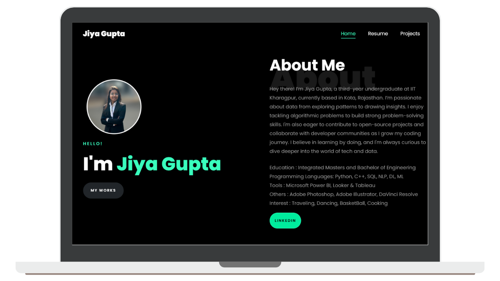

<h2 align="center">
  Portfolio Website 
  <a href="https://jiya-porfolio.netlify.app/" target="_blank">Jiya Gupta</a>
</h2>

  

My personal portfolio <a href="https://jiya-porfolio.netlify.app/" target="_blank">jiya_portfolio</a> which features some of my github projects as well as my resume and technical skills. 

## Features

⚡️ Modern UI Design\
⚡️ One Page Layout\
⚡️ Styled with Bootstrap v4.3 + Custom SCSS\
⚡️ Fully Responsive\
⚡️ Valid HTML5 & CSS3\
⚡️ Optimized with Parcel\
⚡️ Well organized documentation

## Technologies used 

- [Parcel](https://parceljs.org/) - Bundler
- [Bootstrap 4](https://getbootstrap.com/docs/4.3/getting-started/introduction/) - Frontend component library
- [Sass](https://sass-lang.com/documentation) - CSS extension language
- [ScrollReveal.js](https://scrollrevealjs.org/) - JavaScript library
- [Tilt.js](https://gijsroge.github.io/tilt.js/) - JavaScript tiny parallax library

